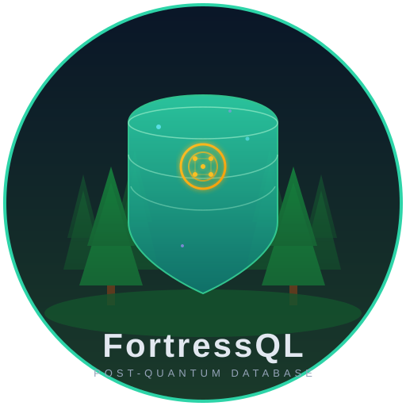

<p align="center">
  
</p>

<h1 align="center">FortressQL</h1>

<p align="center">
  <strong>Post-Quantum Cryptography for PostgreSQL</strong>
</p>

<p align="center">
  A hardened fork of PostgreSQL 17 with NIST-standardized post-quantum cryptography<br>
  integrated across TLS, authentication, transparent data encryption, replication, backups, and audit.
</p>

<p align="center">
  <a href="doc/fortressql-admin-guide.md">Admin Guide</a> |
  <a href="doc/fortressql-threat-model.md">Threat Model</a> |
  <a href="#quick-start">Quick Start</a> |
  <a href="#building">Build from Source</a>
</p>

---

## Feature Status

| Feature | Status | NIST Level | Algorithm |
|---------|--------|------------|-----------|
| PQC TLS (hybrid key exchange) | Stable | Level 3 | X25519MLKEM768 |
| PQC Certificate Auth (pqc-cert) | Stable | Level 3 | ML-DSA-65, SLH-DSA |
| PQC SCRAM-SHA-384 Auth | Stable | Level 3 | SHA-384 |
| Transparent Data Encryption (TDE) | Stable | Level 3 | AES-256-CTR + ML-KEM-768 |
| WAL Signing | Stable | Level 3 | ML-DSA-65 |
| PQC-Encrypted Backups | Stable | Level 3 | ML-KEM-768 + ML-DSA-65 |
| Crypto Agility Engine | Stable | Level 3/5 | Policy-driven |
| Hybrid Proof Logging | Stable | Level 3 | Ed25519 + ML-DSA-65 |
| pgcrypto_pqc Extension | Stable | Level 1-5 | ML-KEM, ML-DSA, SLH-DSA |

---

## Quick Start

Get FortressQL running with PQC TLS in 5 minutes on Ubuntu 24.04.

```bash
# 1. Install dependencies
sudo apt install -y build-essential meson ninja-build cmake git \
    libssl-dev libreadline-dev zlib1g-dev flex bison pkg-config

# 2. Build and install liboqs
git clone --depth 1 https://github.com/open-quantum-safe/liboqs.git
cd liboqs && mkdir build && cd build
cmake -GNinja -DCMAKE_INSTALL_PREFIX=/usr/local -DBUILD_SHARED_LIBS=ON -DOQS_BUILD_ONLY_LIB=ON ..
ninja && sudo ninja install && sudo ldconfig
cd ../..

# 3. Build FortressQL
cd sql-pqc
meson setup build -Dpqc=enabled -Dssl=openssl
meson compile -C build
sudo meson install -C build

# 4. Initialize and start
sudo -u postgres initdb -D /var/lib/fortressql/data
# Edit /var/lib/fortressql/data/postgresql.conf:
#   ssl = on
#   ssl_pqc_mode = 'hybrid'
#   ssl_cert_file = '/path/to/server.crt'
#   ssl_key_file = '/path/to/server.key'
sudo -u postgres pg_ctl -D /var/lib/fortressql/data start

# 5. Connect with PQC TLS
psql "host=localhost sslmode=require sslpqcgroups=X25519MLKEM768"
```

For production setup (TDE, WAL signing, authentication, key management), see the [Administrator's Guide](doc/fortressql-admin-guide.md).

---

## Why FortressQL?

Quantum computers threaten current cryptographic standards. The **"harvest now, decrypt later"** attack means data encrypted today with classical algorithms can be stored and decrypted once quantum computers mature. NIST has finalized three post-quantum cryptographic standards to address this threat.

FortressQL integrates these standards directly into PostgreSQL, providing quantum-resistant protection across every layer of the database stack.

For a detailed analysis of the threats FortressQL addresses (and does not address), see the [Threat Model](doc/fortressql-threat-model.md).

## NIST PQC Algorithms

| Algorithm | Standard | Purpose | Variants |
|-----------|----------|---------|----------|
| **ML-KEM** | FIPS 203 | Key Encapsulation | ML-KEM-512, ML-KEM-768, ML-KEM-1024 |
| **ML-DSA** | FIPS 204 | Digital Signatures | ML-DSA-44, ML-DSA-65, ML-DSA-87 |
| **SLH-DSA** | FIPS 205 | Hash-Based Signatures | 12 variants (SHA-2 and SHAKE) |

## Features

### PQC TLS Transport
Hybrid key exchange combining classical and post-quantum algorithms for defense-in-depth.

```
# postgresql.conf
ssl_pqc_mode = 'hybrid'                              # off | hybrid | pqc-only
ssl_pqc_groups = 'X25519MLKEM768:X25519:prime256v1'   # key exchange groups
ssl_pqc_sigalgs = 'mldsa65:ed25519'                   # certificate signature algorithms
```

```bash
# Client connection with PQC TLS
psql "host=localhost sslmode=require sslpqcgroups=X25519MLKEM768"
```

Monitor negotiated PQC groups via `pg_stat_ssl`:
```sql
SELECT pid, ssl_version, ssl_cipher, pqc_group FROM pg_stat_ssl;
```

### PQC Authentication

Two new authentication methods in `pg_hba.conf`:

```
# PQC certificate authentication (ML-DSA / SLH-DSA certificates)
hostssl all all 0.0.0.0/0 pqc-cert

# SCRAM-SHA-384 (NIST Level 3 aligned)
hostssl all all 0.0.0.0/0 pqc-scram-sha-384
```

- **`pqc-cert`** -- Verifies client certificates use post-quantum signature algorithms
- **`pqc-scram-sha-384`** -- SCRAM authentication with SHA-384 (48-byte keys)

### pgcrypto_pqc Extension

SQL-callable PQC functions for application-level encryption:

```sql
CREATE EXTENSION pgcrypto_pqc;

-- Key Encapsulation (ML-KEM)
SELECT * FROM pqc_kem_keygen('ML-KEM-768');
SELECT * FROM pqc_kem_encapsulate(public_key, 'ML-KEM-768');
SELECT pqc_kem_decapsulate(ciphertext, secret_key, 'ML-KEM-768');

-- Digital Signatures (ML-DSA, SLH-DSA)
SELECT * FROM pqc_sig_keygen('ML-DSA-65');
SELECT pqc_sign('message'::bytea, secret_key, 'ML-DSA-65');
SELECT pqc_verify('message'::bytea, signature, public_key, 'ML-DSA-65');

-- Hybrid Encryption (ML-KEM + AES-256-GCM)
SELECT * FROM pqc_encrypt('sensitive data'::bytea, 'ML-KEM-768');
SELECT pqc_decrypt(encrypted_data, encapsulated_key, secret_key, 'ML-KEM-768');

-- Algorithm Discovery
SELECT * FROM pqc_algorithms();
```

### Transparent Data Encryption (TDE)

Encrypt heap pages, indexes, and WAL at rest using ML-KEM-derived keys with AES-256-CTR. No other PostgreSQL fork offers PQC-native encryption at rest.

```
# postgresql.conf
fortressql_tde_enabled = on
fortressql_master_key_command = 'vault read -field=key secret/fortressql/master'
fortressql_kem_algorithm = 'ML-KEM-768'
```

Key hierarchy: **Master Key** (ML-KEM wrapped) -> **Tablespace Keys** (AES-256-GCM encrypted) -> **Page IVs** (HKDF derived)

```sql
-- Create an encryption key for a tablespace
CREATE ENCRYPTION KEY my_key ALGORITHM 'ML-KEM-768';
CREATE TABLESPACE secure_data LOCATION '/data/secure' ENCRYPTION KEY my_key;

-- All tables in the tablespace are transparently encrypted at rest
CREATE TABLE secrets (id int, data text) TABLESPACE secure_data;
```

### Quantum-Safe WAL Signing

Every completed WAL segment is digitally signed with ML-DSA for tamper detection. Standbys verify signatures before applying WAL.

```
# postgresql.conf
wal_pqc_signing = on
wal_pqc_signing_algorithm = 'ML-DSA-65'
wal_pqc_key_path = '/etc/fortressql/wal_keys'
wal_pqc_verify_on_receive = on
```

### PQC-Encrypted Backups

`pg_dump` and `pg_restore` support ML-KEM encrypted and ML-DSA signed backups:

```bash
# Create an encrypted + signed backup
pg_dump --pqc-encrypt --pqc-encrypt-key=recipient.pub \
        --pqc-sign --pqc-sign-key=signer.key \
        mydb > backup.dump

# Restore with decryption + signature verification
pg_restore --pqc-decrypt-key=recipient.key \
           --pqc-verify-key=signer.pub \
           backup.dump
```

### Crypto Agility Engine

One command to set the security posture across TLS, auth, encryption, and replication:

```sql
ALTER SYSTEM SET crypto_policy = 'fips-pqc-level3';
SELECT pg_reload_conf();

-- Cascades to:
--   password_encryption = 'scram-sha-384'
--   ssl_pqc_mode = 'hybrid'
--   ssl_pqc_groups = 'X25519MLKEM768:...'
--   ssl_pqc_sigalgs = 'mldsa65:mldsa87'
```

Available policies: `legacy`, `transitional`, `fips-pqc-level3`, `fips-pqc-level5`, `custom`

Batch-migrate existing credentials:
```sql
-- Report which users need credential upgrades
SELECT * FROM pqc_migrate_credentials('report');

-- Force password reset for all SHA-256 users
SELECT * FROM pqc_migrate_credentials('force-reset');
```

Monitor policy status:
```sql
SELECT * FROM pg_crypto_policy_status;
```

### Hybrid Proof Logging

Tamper-evident audit log with dual classical (Ed25519) + PQC (ML-DSA) signatures and hash-chain integrity:

```sql
-- Initialize audit keys
SELECT pqc_audit_init_keys('Ed25519', 'ML-DSA-65');

-- Audit events are captured automatically for:
-- DDL (CREATE/ALTER/DROP ROLE), GRANT/REVOKE, ALTER SYSTEM
-- Enable via: SET pqc_audit.enabled = on;

-- Verify the entire audit chain
SELECT * FROM pqc_audit_verify_chain();

-- Manual dual-signing
SELECT * FROM pqc_audit_sign('important message'::bytea);
```

### PQC Cluster Communication

Streaming replication inherits PQC TLS and WAL signing automatically:
```
# postgresql.conf on standby
primary_conninfo = 'host=primary sslmode=verify-full sslpqcmode=hybrid sslpqcgroups=X25519MLKEM768'
```

## Architecture

```
+--------------------------------------------------------------+
|                    FortressQL Server                          |
|                                                               |
|  +--------------------------------------------------------+   |
|  |  Crypto Agility Engine                                  |  |
|  |  - crypto_policy = fips-pqc-level3 | level5 | custom    |  |
|  |  - Cascades to all layers below                         |  |
|  +--------------------------------------------------------+   |
|                                                               |
|  +--------------------------------------------------------+   |
|  |  PQC TLS Transport (OpenSSL 3.x + liboqs)               |  |
|  |  - Hybrid key exchange (X25519MLKEM768)                 |  |
|  |  - PQC certificate verification (ML-DSA, SLH-DSA)       |  |
|  +--------------------------------------------------------+   |
|                                                               |
|  +--------------------------------------------------------+   |
|  |  PQC Authentication                                     |  |
|  |  - pqc-cert (ML-DSA/SLH-DSA client certificates)        |  |
|  |  - pqc-scram-sha-384 (NIST Level 3)                     |  |
|  +--------------------------------------------------------+   |
|                                                               |
|  +--------------------------------------------------------+   |
|  |  Transparent Data Encryption (TDE)                      |  |
|  |  - AES-256-CTR page encryption (header cleartext)       |  |
|  |  - ML-KEM-768 master key wrapping                       |  |
|  |  - Per-tablespace data encryption keys                  |  |
|  |  - WAL encryption with XLP_ENCRYPTED flag               |  |
|  +--------------------------------------------------------+   |
|                                                               |
|  +--------------------------------------------------------+   |
|  |  Quantum-Safe Replication                               |  |
|  |  - ML-DSA signed WAL segments (.sig sidecar files)      |  |
|  |  - Signature verification on standbys                   |  |
|  +--------------------------------------------------------+   |
|                                                               |
|  +--------------------------------------------------------+   |
|  |  Hybrid Proof Logging                                   |  |
|  |  - Dual Ed25519 + ML-DSA signatures per audit entry     |  |
|  |  - SHA-384 hash chain for tamper evidence               |  |
|  +--------------------------------------------------------+   |
|                                                               |
|  +--------------------------------------------------------+   |
|  |  pgcrypto_pqc Extension + PQC Backups                   |  |
|  |  - SQL-callable KEM, signatures, hybrid encryption      |  |
|  |  - pg_dump --pqc-encrypt / --pqc-sign                   |  |
|  |  - Credential migration tooling                         |  |
|  +--------------------------------------------------------+   |
|                                                               |
|  +--------------------------------------------------------+   |
|  |  PQC Abstraction Layer (liboqs)                         |  |
|  |  - Unified C API for ML-KEM, ML-DSA, SLH-DSA            |  |
|  |  - Secure memory management (explicit_bzero)            |  |
|  +--------------------------------------------------------+   |
+--------------------------------------------------------------+
```

## Building

### Prerequisites

- **OpenSSL** 3.0 or later (3.5+ recommended for native PQC support)
- **liboqs** (Open Quantum Safe) -- required for PQC features
- **oqs-provider** -- required for PQC TLS on OpenSSL < 3.5
- **meson** 1.1+ and **ninja** -- build system
- Standard PostgreSQL build dependencies (flex, bison, readline, zlib)

### Build on Ubuntu 24.04

```bash
# Install dependencies
sudo apt install -y build-essential meson ninja-build cmake git pkg-config \
    flex bison libssl-dev libreadline-dev zlib1g-dev libxml2-dev \
    libxslt1-dev libicu-dev liblz4-dev libzstd-dev python3

# Build liboqs
git clone --depth 1 https://github.com/open-quantum-safe/liboqs.git
cd liboqs && mkdir build && cd build
cmake -GNinja -DCMAKE_INSTALL_PREFIX=/usr/local -DBUILD_SHARED_LIBS=ON -DOQS_BUILD_ONLY_LIB=ON ..
ninja && sudo ninja install && sudo ldconfig
cd ../..

# Build oqs-provider (skip if OpenSSL >= 3.5)
git clone --depth 1 https://github.com/open-quantum-safe/oqs-provider.git
cd oqs-provider && mkdir build && cd build
cmake -GNinja -DCMAKE_INSTALL_PREFIX=/usr/local -Dliboqs_DIR=/usr/local/lib/cmake/liboqs ..
ninja && sudo ninja install
cd ../..

# Build FortressQL
cd sql-pqc
meson setup build -Dssl=openssl -Dpqc=enabled
meson compile -C build
sudo meson install -C build
```

For RHEL/Rocky 9 and detailed configuration, see the [Administrator's Guide](doc/fortressql-admin-guide.md).

### Build Options

| Option | Values | Default | Description |
|--------|--------|---------|-------------|
| `-Dpqc` | `enabled`, `disabled`, `auto` | `auto` | PQC support (auto-detects liboqs) |
| `-Dssl` | `openssl` | -- | Required for TLS features |
| `-Dcassert` | `true`, `false` | `false` | Enable C assertion checks (testing only) |

### Run Tests

```bash
cd build
meson test --suite pqc --print-errorlogs    # PQC-specific tests
meson test --suite regress --print-errorlogs # Core regression tests
```

## Compatibility

- **PQC disabled**: Produces binaries identical to vanilla PostgreSQL 17
- **All PQC code** is guarded by `#ifdef USE_PQC` compile flags
- **Hybrid-first defaults**: Classical algorithms always included as fallback
- **Client compatibility**: Non-PQC clients connect normally via classical TLS

## Configuration Reference

### Server (postgresql.conf)

| Parameter | Type | Default | Description |
|-----------|------|---------|-------------|
| **Crypto Policy** | | | |
| `crypto_policy` | enum | `custom` | `legacy`, `transitional`, `fips-pqc-level3`, `fips-pqc-level5`, `custom` |
| **PQC TLS** | | | |
| `ssl_pqc_mode` | enum | `hybrid` | `off`, `hybrid`, or `pqc-only` |
| `ssl_pqc_groups` | string | `X25519MLKEM768:X25519:prime256v1` | Key exchange groups |
| `ssl_pqc_sigalgs` | string | *(empty)* | TLS signature algorithms |
| **Transparent Data Encryption** | | | |
| `fortressql_tde_enabled` | bool | `off` | Enable TDE for data at rest |
| `fortressql_master_key_command` | string | *(empty)* | Command to retrieve master key passphrase |
| `fortressql_kem_algorithm` | enum | `ML-KEM-768` | KEM algorithm for master key wrapping |
| **WAL Signing** | | | |
| `wal_pqc_signing` | bool | `off` | Enable ML-DSA signing of WAL segments |
| `wal_pqc_signing_algorithm` | string | `ML-DSA-65` | Signature algorithm for WAL |
| `wal_pqc_key_path` | string | *(empty)* | Path to WAL signing keypair |
| `wal_pqc_verify_on_receive` | bool | `on` | Verify WAL signatures on standbys |
| **Audit** | | | |
| `pqc_audit.enabled` | bool | `off` | Enable hybrid proof logging |
| `pqc_audit.events` | string | `ddl,auth,policy,grant` | Event categories to audit |

For detailed parameter descriptions, defaults, and recommended values, see the [Administrator's Guide](doc/fortressql-admin-guide.md#postgresqlconf-reference).

### Client (connection string)

| Parameter | Description |
|-----------|-------------|
| `sslpqcmode` | PQC mode: `off`, `hybrid`, `pqc-only` |
| `sslpqcgroups` | Key exchange groups (colon-separated) |

### pg_dump / pg_restore

| Option | Description |
|--------|-------------|
| `--pqc-encrypt` | Enable ML-KEM encrypted backup |
| `--pqc-encrypt-key=FILE` | Recipient's ML-KEM public key |
| `--pqc-encrypt-algorithm=ALG` | KEM algorithm (default: ML-KEM-768) |
| `--pqc-sign` | Enable ML-DSA signed backup |
| `--pqc-sign-key=FILE` | Signer's ML-DSA secret key |
| `--pqc-sign-algorithm=ALG` | Signature algorithm (default: ML-DSA-65) |
| `--pqc-decrypt-key=FILE` | Recipient's ML-KEM secret key (restore) |
| `--pqc-verify-key=FILE` | Signer's ML-DSA public key (restore) |

## Documentation

- **[Administrator's Guide](doc/fortressql-admin-guide.md)** -- Installation, configuration, key management, backup, monitoring, and troubleshooting
- **[Threat Model](doc/fortressql-threat-model.md)** -- Threat landscape, protection matrix, scope boundaries, and compliance mapping (SOC 2, HIPAA, FedRAMP, CMMC)

## Contributing

Contributions are welcome. FortressQL follows the same development practices as PostgreSQL.

### Getting Started

1. Fork the repository and create a feature branch
2. Build with assertions enabled: `meson setup build -Dpqc=enabled -Dssl=openssl -Dcassert=true`
3. Run the full test suite: `meson test -C build --print-errorlogs`
4. Submit a pull request with a clear description of the change

### Guidelines

- All PQC code must be guarded by `#ifdef USE_PQC` so that builds with `-Dpqc=disabled` produce vanilla PostgreSQL binaries
- New PQC features must include regression tests in the `pqc` test suite
- Follow PostgreSQL coding conventions (C99, tabs for indentation, comment style)
- Cryptographic code must use the PQC abstraction layer (`src/common/pqc/`) rather than calling liboqs directly
- Security-sensitive changes should include a brief threat analysis in the PR description
- Sensitive key material must be zeroed after use with `explicit_bzero()`

### Reporting Security Issues

If you discover a security vulnerability, please report it privately. Do not open a public issue. Send details to the maintainers via the process described in SECURITY.md.

## License

FortressQL is released under the [PostgreSQL License](COPYRIGHT), the same permissive open-source license as PostgreSQL.

Portions Copyright (c) 2024-2026, FortressQL Contributors
Portions Copyright (c) 1996-2026, PostgreSQL Global Development Group

## Acknowledgments

- [PostgreSQL](https://www.postgresql.org/) -- The foundation
- [Open Quantum Safe (liboqs)](https://openquantumsafe.org/) -- PQC algorithm implementations
- [NIST Post-Quantum Cryptography](https://csrc.nist.gov/projects/post-quantum-cryptography) -- Standards
